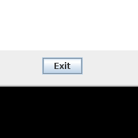

## BioLogger

Cross-platform keyboard and mouse event capture tool.

This application uses the [jnativehook](https://github.com/kwhat/jnativehook/) library to register system-wide hooks for keyboard and mouse events. The types of events captured include: keystrokes, mouse motion, mouse clicks, and scrolling (mouse wheel). The events are recorded to CSV files (one file for each event type).

To run, download the [latest release](https://github.com/vmonaco/biologger/releases/download/v1.0/biologger-1.0.jar) and run the executable jar. From the command line,

    $ java -jar biologger.jar

By default, the CSV files will be created in the current working directory. To specify a different output directory, use the `-o` option. Certain event types can also be ignored, such as `-im` to ignore mouse motion events. The full usage is:
```
usage: biologger
 -h,--help                print this help message
 -ic,--ignore-click       ignore mouse click events
 -ik,--ignore-keystroke   ignore keystroke events
 -im,--ignore-motion      ignore ignore mouse motion events
 -iw,--ignore-wheel       ignore mouse wheel events
 -nw,--no-window          don't start the user interface
 -o,--output <arg>        output directory
 -v,--verbose             verbose mode
```

## Keystroke events

Name | Description
--- | ---
press_time | key press timestamp (ms)
release_time | key release timestamp (ms)
key_code | numeric key code (see keycodes.csv for a table)
key_name | human-readable key name
modifier_code | modifier key codes pressed during the event
modifier_name | modifier key names pressed during the event (e.g., ctr+shift)
location | 2 for left, 3 for right, 1 for keys that have a single location

## Mouse motion events

Name | Description
--- | ---
time | timestamp (ms)
x | absolute x location of the pointer (pixels)
y | absolute y location of the pointer (pixels)
modifier_code | modifier key codes pressed during the event
modifier_name | modifier key names pressed during the event
dragged | 1 if a mouse button was held down during the event, 0 otherwise

## Mouse click events

Name | Description
--- | ---
press_time | press timestamp (ms)
release_time | release timestamp (ms)
button_code | mouse button numeric code (typically 1, 2, or 3)
press_x | absolute x position at the press time
press_y | absolute y position at the press time
release_x | absolute x position at the release time
release_y | absolute y position at the release time
modifier_code | modifier key codes pressed during the event
modifier_name | modifier key names pressed during the event
image | base64 encoded 200x200 image centered on the press position

The `image` attribute is a base64 encoded image centered on the press location. This can be used to provide context for where the user clicked the mouse, for example how close to the edge of a button the click occured.

The following python code decodes and displays the last click image in `mouseclick.csv`:
```python
import io
import base64
import pandas as pd
from PIL import Image

df = pd.read_csv('mouseclick.csv')
i = df.iloc[-1].image
image = Image.open(io.BytesIO(base64.b64decode(i)))
image.show()
```
<div align="center">
  <br><br>
</div>

## Mouse wheel events

Name | Description
--- | ---
time | timestamp (ms)
amount | magnitude of the wheel event
direction | direction of the wheel event (either +1 or -1)
type | 0 for unit, 1 for block
x | absolute x location of the pointer device
y | absolute y location of the pointer device
modifier_code | modifier key codes pressed during the event
modifier_name | modifier key names pressed during the event
